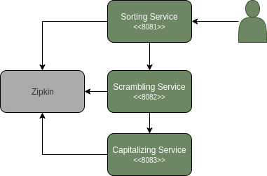

## Sleuth Implementation   
This stands for the implementation utilizing Spring Cloud Sleuth. A library of the Spring family that facilitates a billion times the usage of Zipkin in your project.

## Implementation Architecture

